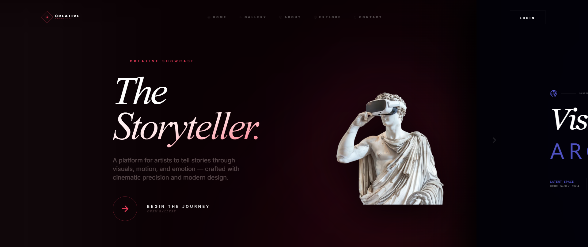

#  Creative Showcase
### A Modern Artist Portfolio & Discovery Platform


🔗 **Live Frontend Demo:**  
👉 https://creativeshow.netlify.app  
*(Frontend only — to use backend features, clone the repository and run the server locally.)*


## 🎬 Demo Preview

[](https://youtu.be/-CETb7fupR4)


**Creative Showcase** is a full-stack web application designed to help artists showcase their digital artwork, build a public presence, and connect with a creative community.  
The platform combines cinematic visuals with modern web technologies to deliver a smooth, engaging, and scalable experience.

Built using **React, Node.js, Express, and MongoDB**, this project focuses on performance, clean architecture, and an artist-first design philosophy.

---

##  Features

-  **Cinematic Hero Section**  
  Smooth animations, immersive visuals, and premium scroll interactions.

-  **Dynamic Public Gallery**  
  Pinterest-style masonry layout with randomized artwork display.

-  **Authentication System**  
  Secure user registration and login using JWT.

-  **Artist Profiles**  
  Public artist profiles with artworks, bios, and social statistics.

-  **Social Interactions**  
  Like and follow system with real-time updates.

-  **Responsive Design**  
  Fully optimized for mobile, tablet, and desktop.

-  **Secure File Uploads**  
  Image validation, size limits, and protected storage.

-  **Real-Time Updates**  
  Live likes, follows, and profile updates without page reloads.

---

##  Tech Stack

### Frontend
- React 18 with TypeScript  
- Tailwind CSS  
- Framer Motion (animations)  
- Lucide React (icons)

### Backend
- Node.js with Express  
- MongoDB with Mongoose  
- JWT Authentication  
- Multer (file uploads)  
- bcryptjs (password hashing)

---

##  Getting Started

### Prerequisites
- Node.js (v16 or higher)
- MongoDB (local or MongoDB Atlas)
- npm or yarn

---

### Installation


### Installation

1. **Clone the repository**
   ```bash
   git clone https://github.com/Soumya-Xd/CreativeShowcase
   cd creative-showcase
   ```

2. **Install dependencies**
   ```bash
   npm install
   ```

3. **Set up environment variables**
   ```bash
   cp .env.example .env
   ```
   
   Update the `.env` file with your MongoDB connection string:
   ```
   MONGODB_URI=mongodb://localhost:27017/creative-showcase
   JWT_SECRET=your-super-secret-jwt-key
   PORT=5000
   ```

4. **Start MongoDB**
   Make sure MongoDB is running on your system:
   ```bash
   # For local MongoDB installation
   mongod
   
   # Or use MongoDB Atlas cloud database
   ```

5. **Start the backend server**
   ```bash
   npm run server
   ```
   
   The API will be available at `http://localhost:5000`

6. **Start the frontend development server**
   ```bash
   npm run dev
   ```
   
   The application will be available at `http://localhost:5173`

## API Endpoints

### Authentication
- `POST /api/auth/register` - Register new user
- `POST /api/auth/login` - User login
- `GET /api/auth/me` - Get current user

### Artworks
- `GET /api/artworks` - Get all artworks (public)
- `POST /api/artworks` - Create new artwork (protected)
- `GET /api/artworks/:id` - Get artwork by ID
- `PUT /api/artworks/:id` - Update artwork (protected)
- `DELETE /api/artworks/:id` - Delete artwork (protected)
- `POST /api/artworks/:id/like` - Like/unlike artwork (protected)
- `GET /api/artworks/user/:userId` - Get user's artworks

### Users
- `GET /api/users/profile/:username` - Get user profile (public)
- `POST /api/users/:userId/follow` - Follow/unfollow user (protected)
- `PUT /api/users/profile` - Update user profile (protected)
- `GET /api/users/followers` - Get user's followers (protected)
- `GET /api/users/following` - Get user's following (protected)

## Database Schema

### User Model
```javascript
{
  username: String (unique),
  email: String (unique),
  password: String (hashed),
  avatar_url: String,
  bio: String,
  followers: [ObjectId],
  following: [ObjectId],
  artworks: [ObjectId]
}
```

### Artwork Model
```javascript
{
  title: String,
  description: String,
  image_url: String,
  artist: ObjectId (ref: User),
  likes: [ObjectId],
  tags: [String],
  createdAt: Date,
  updatedAt: Date
}
```

### Like Model
```javascript
{
  user: ObjectId (ref: User),
  artwork: ObjectId (ref: Artwork),
  createdAt: Date
}
```

## Development Scripts

- `npm run dev` - Start frontend development server
- `npm run server` - Start backend server
- `npm run dev:server` - Start backend with nodemon (auto-restart)
- `npm run build` - Build for production
- `npm run preview` - Preview production build

## Features in Detail

### Authentication System
- Secure password hashing with bcryptjs
- JWT token-based authentication
- Protected routes for authenticated users
- Automatic token refresh

### File Upload System
- Multer middleware for handling multipart/form-data
- File validation (image types only)
- Size limits (10MB max)
- Secure file storage in server uploads directory

### Social Features
- Like/unlike artworks with real-time count updates
- Follow/unfollow artists
- User profiles with statistics
- Activity feeds and notifications

### Responsive Design
- Mobile-first approach
- Flexible grid layouts
- Touch-friendly interactions
- Optimized images and loading states

## Contributing

1. Fork the repository
2. Create a feature branch (`git checkout -b feature/amazing-feature`)
3. Commit your changes (`git commit -m 'Add some amazing feature'`)
4. Push to the branch (`git push origin feature/amazing-feature`)
5. Open a Pull Request

## License

This project is licensed under the MIT License - see the LICENSE file for details.
